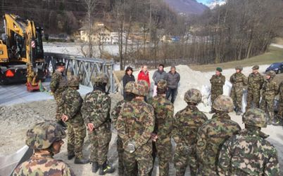

+++
title = "Ist die obligatorische Militärpflicht noch zeitrelevant?"
date = "2023-05-08"
draft = false
pinned = false
+++
5,24 Milliarden Franken betrugen die Militärausgaben der Schweizer Armee allein für das Jahr 2021. Im Vorjahr waren es 6 Milliarden mehr. Immer wieder gibt es Diskussionen, ob es richtig sei, so viel Geld für das Militär auszugeben oder überhaupt noch eines zu haben. Die Meinungen gehen dabei oft auseinander, und dies besonders bei den unterschiedlichen Altersgruppen. Häufig wird bei diesen Gesprächen auch die Obligatorische Militärpflicht mit eingebunden, welche in dieser Reportage nun auch das Hauptthema ist. Die Militärpflicht wird häufig kritisiert, und auch ich hatte bereits mit anderen Personen darüber geredet und diskutiert. Bei der Militärpflicht gibt es verschiedene Möglichkeiten, diese auszuüben. Der größte Prozentanteil ist dabei die Rekrutenschule (RS).

#### **Die Geschichte und Funktion der Rekrutenschule**

Die Rekrutenschule gibt es seit dem Jahr 1848, seit die Schweiz ihre Armee neu organisiert hatte. Sie ist ein wichtiger Bestandteil der Schweizer Wehrpflicht und gilt für alle männlichen Schweizer Bürger zwischen dem 18. und dem 34. Lebensjahr. Für Frauen ist die Rekrutenschule und die allgemeine Militärpflicht freiwillig. Die Dauer der Rekrutenschule beträgt je nach Gattung und Funktion unterschiedlich lange. Normalerweise aber zwischen 18 und 21 Wochen. Während der Dienstzeit lernen die Soldaten und Soldatinnen die Grundlagen des militärischen Handwerks und Handelns. Dazu gehören zum Beispiel der Umgang mit Waffen, Ausbildung in Infanterie, in der Luftwaffe, im Panzerwesen sowie in Erster Hilfe. Dazu kommt körperliche Fitness, eine Ausbildung in Militärischer Führung, Teamwork, Disziplin, etc.



Der Begriff Militärpflicht beinhaltet sowohl die Rekrutenschule (RS) als auch den Zivildienst.


*Janis Bill, Rekrut*

**Der Dienst an der Gesellschaft durch den Zivildienstes**

Eine andere Möglichkeit, welche immer häufiger gewählt wird, ist der Zivildienst. Der Zivildienst ist mehr ein Dienst an der Gesellschaft und ermöglicht es denjenigen, die aus Gewissensgründen, Überzeugungen oder aus anderen Gründen den Militärdienst verweigern, eine alternative Möglichkeit, ihre Dienstzeit abzuarbeiten. <<Ich mache lieber Zivildienst, wo ich dann etwas mache, was der Gesellschaft etwas bringt>> sagt Jan Baggiolini (Zivildienstler). Der Zivildienst dauert in der Regel aber eineinhalb Mal so lange wie die RS und kann somit bis zu 180 Tagen, was 6 Monaten entspricht, andauern. Während der Dienstzeit leisten die Zivildienstleistenden ihren Dienst in öffentlichen Einrichtungen oder auch in gemeinnützigen Organisationen. Dazu gehören Schulen, Altersheime, Krankenhäuser, etc. Es ist aber auch möglich, in der Landwirtschaft oder im Umweltschutz seinen Dienst zu verrichten.

*Grundauftrag des Zivildienstes                                                                                                                               ©Der Bundesrat*

#### **Positive Aspekte der Rekrutenschule**

Die Frage, ob die Militärpflicht noch zeitgemäß/relevant ist, fand ich die ganze Zeit sehr spannend. Deshalb habe ich mich auch für diese Frage entschieden. Ich habe mich mit Janis Bill, einem Rekruten, der gerade die RS macht, über die positiven Aspekte der RS unterhalten und wir haben einige positive Punkte gefunden. Die Kameradschaft ist für mich einer der größten positiven Aspekte. Man lernt als Gruppe zusammen zu leben und als Team aktiv Aufgaben zu meistern. Es wird Vertrauen aufgebaut und man lernt sich auf andere zu verlassen. Es können viele neue Freundschaften geschlossen werden und somit fördert es den Zusammenhalt. Ein fast genauso wichtiger Punkt ist, dass man sehr viel Sport treibt. Sport ist bekanntlich gut und bereitet dem Menschen Freude. Der Fitness-Aspekt und die allgemeine Herausforderung, sich selbst herauszufordern, sind für viele wie auch für mich einer der Hauptgründe, die RS zu machen. Natürlich gibt es im Zivildienst auch Möglichkeiten, eine körperlich belastende Stelle zu haben, jedoch ist dies in der Rekrutenschule deutlich einfacher. Die Erlernung von neuen Fähigkeiten oder Wissen war für mich komplett in Vergessenheit geraten. Sowohl in der RS als auch im Zivildienst lernt man viele neue Dinge. Dazu können Navigation mit Karte und Kompass gehören, das Umgehen mit Waffen oder das genaue Arbeiten mit Tabletten etc. bei älteren Menschen.

#### **<<Wer die RS nicht macht, ist eine Memme>>**

Dieser Meinung sind heutzutage viele Personen. Diese Auffassung haben besonders ältere Menschen, da sie noch mit einem älteren Weltbild aufgewachsen sind. <<In dieser Aussage sehe ich gar keinen Punk>>, so Jan Baggiolini. Jan erzählt mir, dass dies seiner Meinung nach ein Vorurteil wäre, welches allen Personen, die im Zivildienst tauglich sind, vorgeworfen wird. Vielen Personen aber gehe es nicht darum, dass sie sich nicht trauen oder sich fürchten. Viele andere Faktoren wie z.B. die moralischen Gründe sind viel öfter entscheidend in der Auswahl zwischen Zivildienst und der Rekrutenschule. Zudem braucht es für die Rekrutenschule nicht mehr Mut als für den Zivildienst, da man nicht einer realen Gefahr ausgesetzt wird. Körperliche Anstrengung ist ebenfalls abhängig von der Funktion einer Person. Ein Bürosoldat hat als Beispiel weniger Anstrengung als ein Zivildienstler, der eine Funktion eingenommen hat, in der er viel Gewichte herumtragen muss.

#### **<<Alles nur Kriegstreiber>>**

Was viele nicht wissen, einschließlich mir vor dem Orientierungstag, ist, dass das Militär zwar zum Schutz unseres Landes vor äußeren Bedrohungen dient, dies jedoch nur ein sehr kleiner Teil dessen ist, was sie wirklich tun. Viel häufiger unterstützt die Armee die Blaulichtorganisationen (Polizei, Sanitäter, Feuerwehr). Auch der Zivildienst oder der Zivilschutz unterstützen diese Organisationen, verfügen jedoch nicht über Hubschrauber oder andere Maschinen, die in bestimmten Situationen erforderlich sein könnten.

#### **Die Rettung des Dorfes Bondo**

Ein sehr gutes Beispiel dafür, wie die Armee in der Schweiz die Blaulichtorganisationen unterstützt, ereignete sich im Jahr 2017 am Piz Cengalo in den Berner Alpen an der Grenze zu Italien. Mehr als drei Millionen Kubikmeter Fels, vermischt mit Schutt und Wasser, stürzten ins Tal hinab. Im Dorf Bondo unten im Talgrund wurden einige Häuser von der Schlammlawine mitgerissen und zerstört. Der Schaden fiel jedoch kleiner aus als gedacht, da durch Bondo ein Fluss verlief und die Schlammlawine gut durch den Fluss hindurchfloss, wodurch viele Häuser nicht getroffen wurden. Sofort wurde gehandelt, die Polizei sperrte das ganze Gebiet um Bondo ab, die Feuerwehr evakuierte alle Personen aus dem Dorf heraus und die Sanitäter kümmerten sich um die Verletzten. Diese drei Einheiten waren komplett ausgelastet und benötigten nun Hilfe, um das nächste Problem zu beheben. Das Flussbecken hatte die Schlammlawine sehr gut geleitet und so den Schaden minimiert, war nun jedoch gefüllt mit dem Gestein etc. und würde für den Fall, dass der Regen kommen würde und eine zweite Schlammlawine lostreten würde, keine Hilfe mehr sein. Ohne Flussbecken war somit der Untergang des Dorfes Bondo sicher. Nun suchte man nach Möglichkeiten und kam auf die Idee, das Flussbecken erneut auszuheben. Um ein Flussbecken erneut auszuheben, benötigt man einen Bagger, der jedoch nicht an Ort und Stelle gebracht werden konnte, einerseits aufgrund der Entfernung, andererseits weil die Brücke bei der Schlammlawine zerstört wurde. Nun kam die Armee ins Spiel, da sie die einzigen sind, die solche leistungsfähigen Hubschrauber haben, um die Bagger vom nächstmöglichen Ort hinüberzufliegen. Nun hatte man also Bagger, doch diese mussten auch bedient werden, und dies war dann der Moment, als der Zivildienst einsprang und mithilfe der Bagger das Flussbecken erneut ausgrub.

*Bondo, Jahr 2017									                                                	                               ©Der Bundesrat*	

**Die Notwendigkeit der Rekrutenschule**
Der gesamte Ablauf und das schnelle Handeln erfordern ausreichend verfügbare Einsatzkräfte. Dies ist nur möglich, wenn wir eine Wehrpflicht haben, da es nicht genug Freiwillige gibt. Jan, Janis und ich sind zu diesem Schluss gekommen und sind alle der Meinung, dass die Wehrpflicht nach wie vor ihre Berechtigung hat.

#### **Meine persönliche Meinung**

Ich denke, es ist wichtig, sich bewusst zu sein, dass die Wehrpflicht auch positive Aspekte hat und nicht direkt abgelehnt werden sollte. Wenn man den Sinn beim Militär nicht sieht und die Rekrutenschule nicht absolvieren möchte, finde ich es dennoch gut, dass man dann den Zivildienst ableisten muss. Dadurch lernt man, Verantwortung zu übernehmen und andere zu unterstützen. Außerdem kann man durch die Erfahrungen, die man während der RS oder des Zivildienstes sammelt, neue Dinge entdecken, die einem gefallen könnten und von denen man vorher nicht gedacht hätte, dass sie einem Spaß machen würden. Selbst wenn man nichts findet, das einem gefällt, weiß man immer noch, dass man aktiv dazu beiträgt, unser Land zu unterstützen und anderen zu helfen.