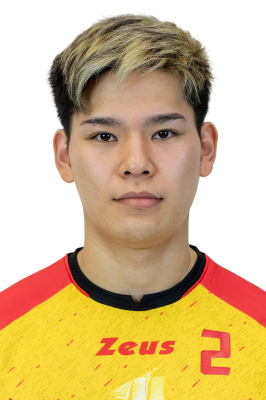

+++
title = "Yuji Nishida der Volleyballgott?"
date = "2023-03-20"
draft = false
pinned = false
tags = ["Volleyball", "Sport"]
description = "\n"
+++
<!--StartFragment-->

He is one of the youngest players in the 2018 roster of the Japan men's national volleyball team and FIVB cup Final.He made his first international performance with the Japanese national team in 2018 FIVB Volleyball Men's Nations League. In June 2018, he played a pivotal role in securing Japan's first win in 11 years against Italy where he collected 24 points from 21 spikes and 3 aces. In September 2018, in a match against Argentina in 2018 FIVB Volleyball Men's World C

hampionship, Nishida became the youngest player ever to score 30 points in a match. In June 2019, Nishida broke serving records in the VNL history after hitting 7 aces in a single game during a match against Canada

Picture: https://en.wikipedia.org/wiki/Yuji*Nishida#/media/File:Y%C5%ABji_Nishida*(Legavolley_2021).png

<!--EndFragment-->